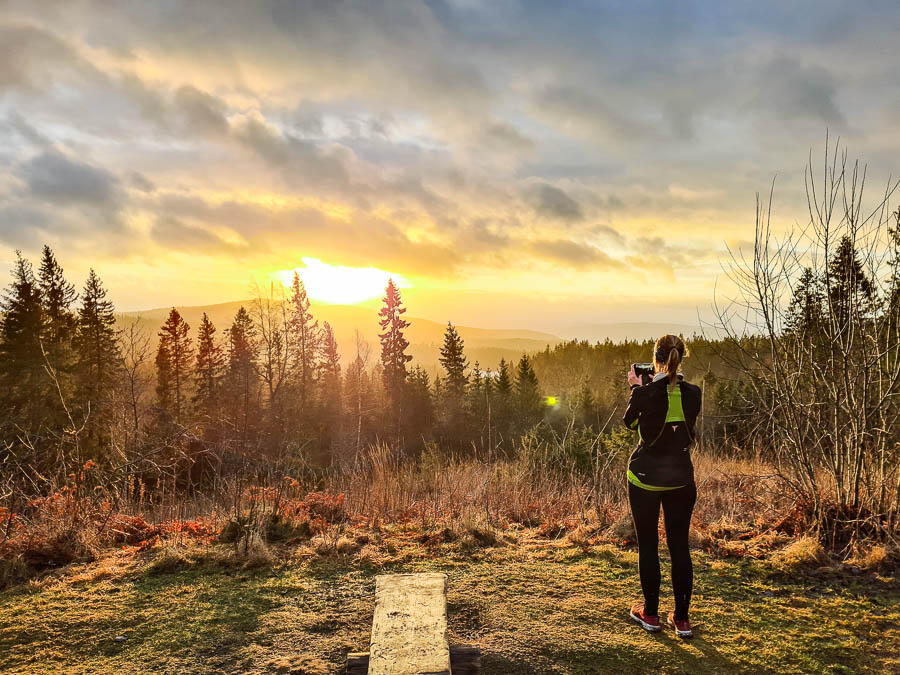
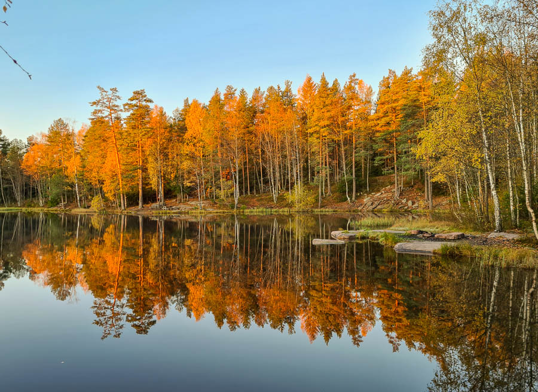
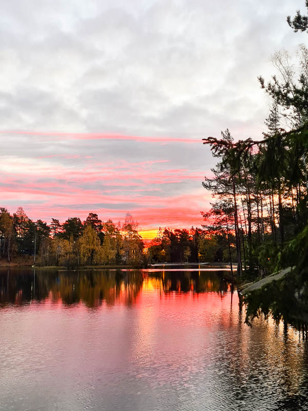
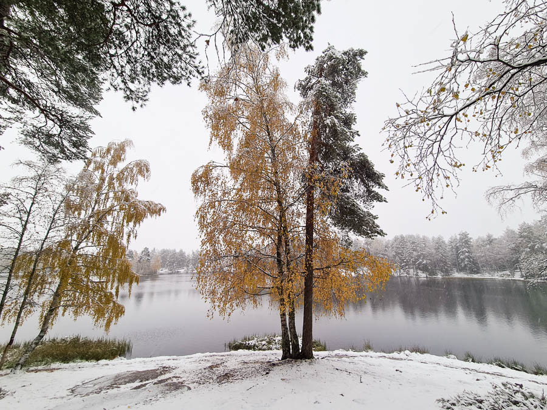
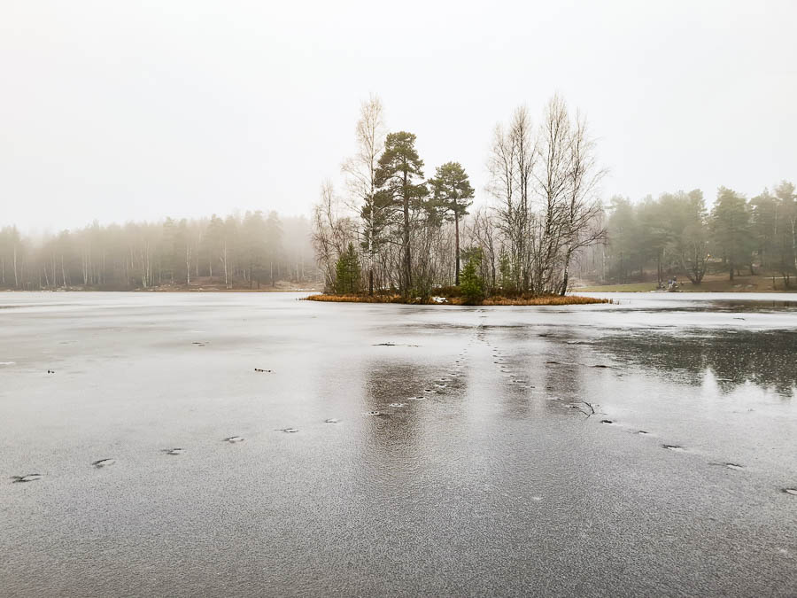
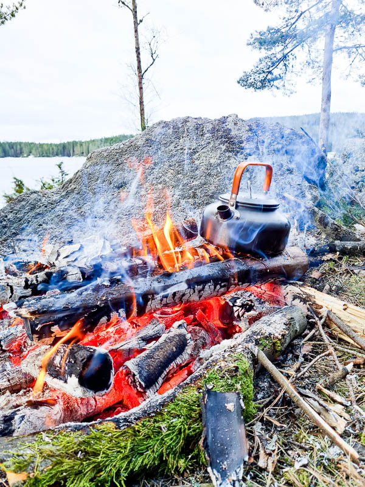
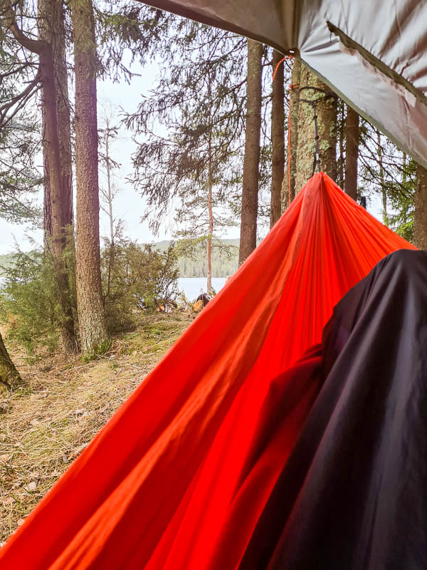
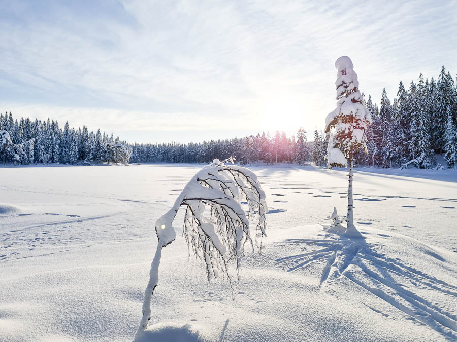
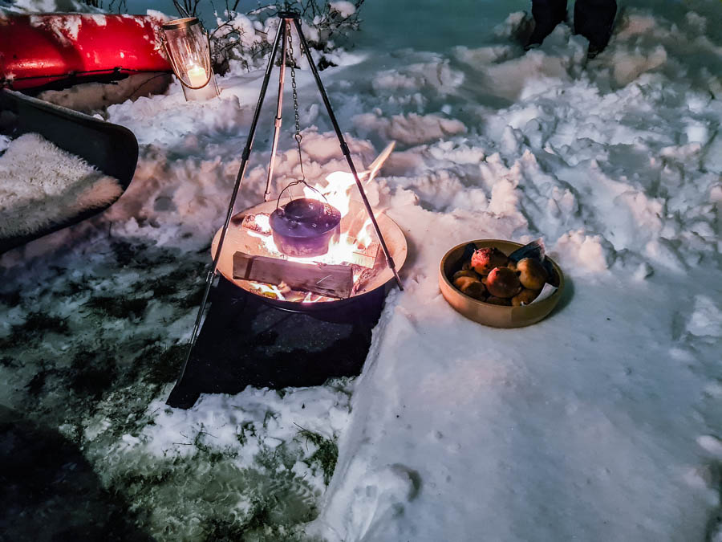

The summer of 2018, [a heat wave flowed over northern europe](https://hess.copernicus.org/articles/24/5621/2020/), driving the temperatures in Oslo up. The mean temperature for July was 23.1 degrees celcius, 5.6 degrees over the normal mean of 17.5 degrees ([statistics from yr.no](https://www.yr.no/nb/historikk/graf/1-72837/Norge/Oslo/Oslo/Oslo?q=2018-07)). We were living in an old brick apartment building, built in 1934. The temperatures inside would generally be at the same level or higher than the outside temperature. Right outside the apartment, we had a heavily trafficed street, where motor cycles liked to rev.

This gave us a dilemma. We could open the windows, to try to make the temperature in the apartment livable (even though there was hardly any wind that summer) but that meant getting a lot of traffic noise inside. We could keep the windows shut (the noise isolation was very good!) but then we would melt away inside. To top it off, this was the summer where our apartment building needed new plumbing, so the water was shut off for long periods. And that was what drove us to move out of the city center.

## Lillomarka here we come

We wanted a place close to the forest, or close to the ocean. With an outdoor space like a balcony or a garden, and preferrably not too far from the city centre or our places of work. And that is exactly what we found at Rødtvet. This post is an ode to [Lillomarka](https://no.wikipedia.org/wiki/Lillomarka), the beautiful forest that we have all around us here. 

View from Lilloseter down to Aurevann

One of the best parts of living here is the fact that we have about a 5 minute walk to a small pond right on the edge of the forest. It is a place that is built up enough to be easily accessible to everyone, but at the sime time still feels like you are in the forest when you are there.

These photos were all taken within a week of each other. The weather changes quickly in the autumn and winter.

## Going a little further

While it is wonderful to have low-effort nature experiences five minutes from the door, another excellent feature of Lillomarka is that there are so many places to camp, sleep, light a fire, skate, walk, bike, or whatever you want to do. 

And to add to it all, we can now light a fire in our back yard! That is not something you are able to do if you live within the city proper.

All the while we are only 15 minutes by subway away from the tall buildings and services of Oslo. Moving out here turned out to be a great choice!